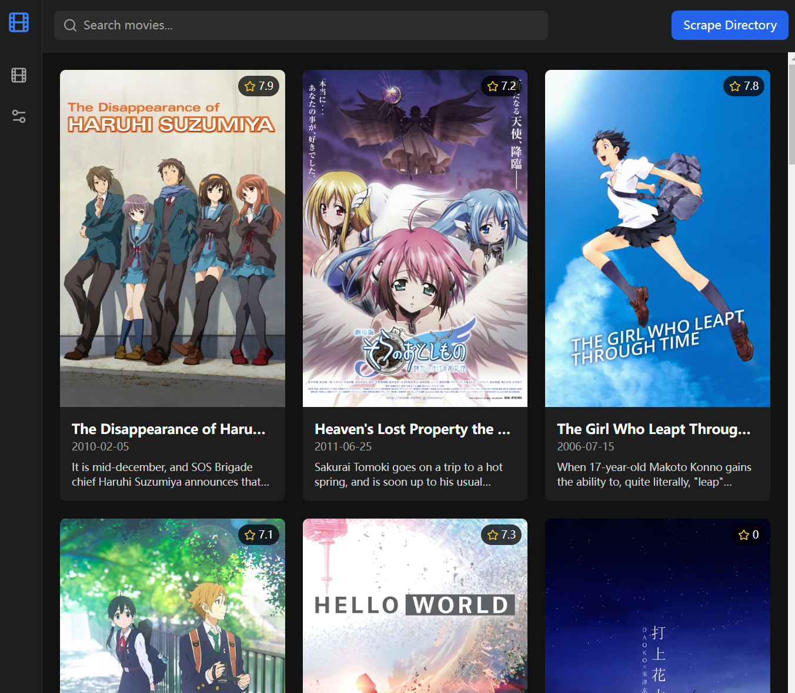

# MyJellyfin
A minimal MIS system built to mimic Jellyfin's movie scraping features.

We use [Vite](https://vite.dev) + [React](https://react.dev) for frontend, and [NestJS](https://nestjs.com) for backend.

## 预览

