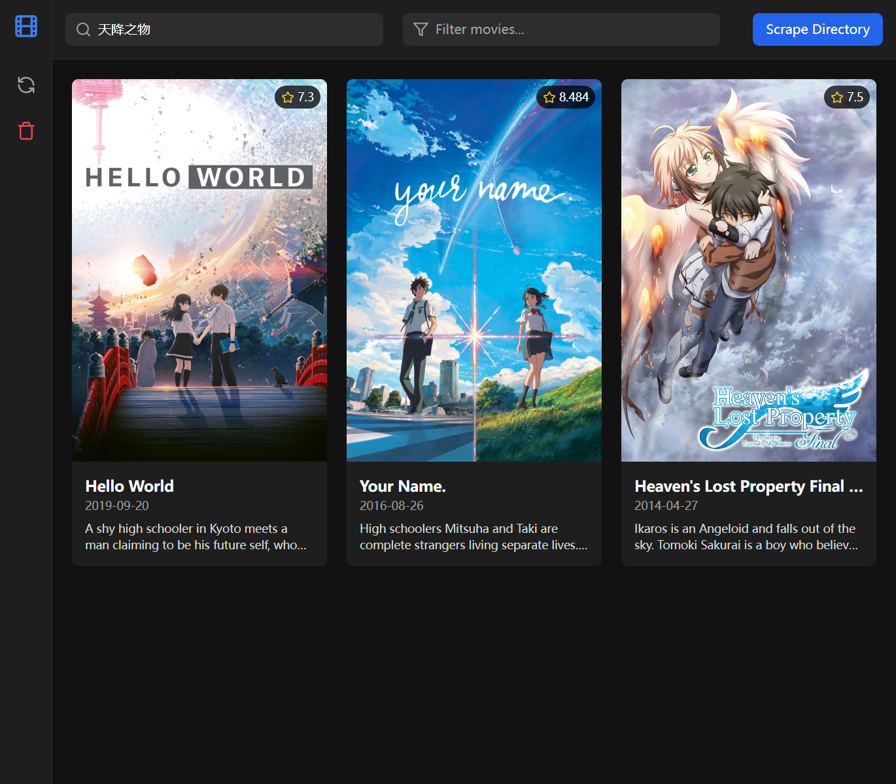

# 🍿 MyJellyfin


**A minimal MIS (Movie Information System)** built to mimic **Jellyfin's movie scraping features**.

This project utilizes:
- **Frontend**: [Vite](https://vite.dev) + [React](https://react.dev)
- **Backend**: [NestJS](https://nestjs.com)

---

## 📸 Preview



Get a glimpse of MyJellyfin in action!

---

## 🚀 How To Deploy

Follow these steps to get started:

### 1️⃣ Clone the repository  
Use `git clone` to download the source code:

```bash
git clone https://github.com/lightmon233/MyJellyfin.git
```

### 2️⃣ Install dependencies  
Navigate to the `frontend` and `backend` directories and run:

```bash
# /frontend
npm install
```

```bash
# /backend
npm install
```

### 3️⃣ Configure your environment  
Create a `.env` file under the `backend` directory with the following settings:

```env
DB_HOST=<your_host_here>
DB_PORT=<your_port_here>
DB_USERNAME=<your_username_here>
DB_PASSWORD=<your_password_here>
DB_NAME=<your_name_here>

NGINX_HOST=<your_host_here>
TMDB_API_KEY=<your_api_key_here>
```

### 4️⃣ Run the services  
Start both frontend and backend services:

```bash
# /frontend
npm run dev
```

```bash
# /backend
npm run start:dev
```

---

## 🛠️ Basic Usage

Here are the core features of **MyJellyfin**:

### 🔍 Search Box  
Enter the movie name in the search box and press Enter to search. The most relevant movie will be selected for download.

### 🎛️ Filter Box  
Type text into the filter box to narrow down the displayed movies by matching titles.

### 📁 Scrape Directory  
Click to select a local directory. All first-level subfolders will be uploaded for scraping.  
**Note**: Ensure each subfolder contains files to be uploaded.

### 🔄 Refresh Button  
Click to reload movie data from the database and refresh the displayed list.

### 🗑️ Trash Icon  
Delete all movies from the database with a single click. This will update the display accordingly.

---

## 📚 Additional Features

Visit the [Wiki Page](https://github.com/lightmon233/MyJellyfin/wiki) to explore advanced functionality and learn more about this project.

---

## 📂 File Structure

```
MyJellyfin/
├── frontend/           # React-based frontend code
├── backend/            # NestJS-based backend code
├── .env.example        # Example environment variables
└── preview.png         # Preview screenshot
```

---

## 🤝 Contributing

We welcome contributions! Feel free to fork this repository, submit issues, or create pull requests.

---

## 📜 License

This project is licensed under the [MIT License](LICENSE).  
Enjoy building your own movie scraping system with **MyJellyfin**! 🌟

